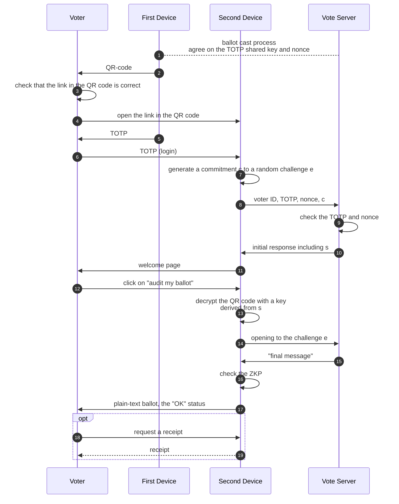
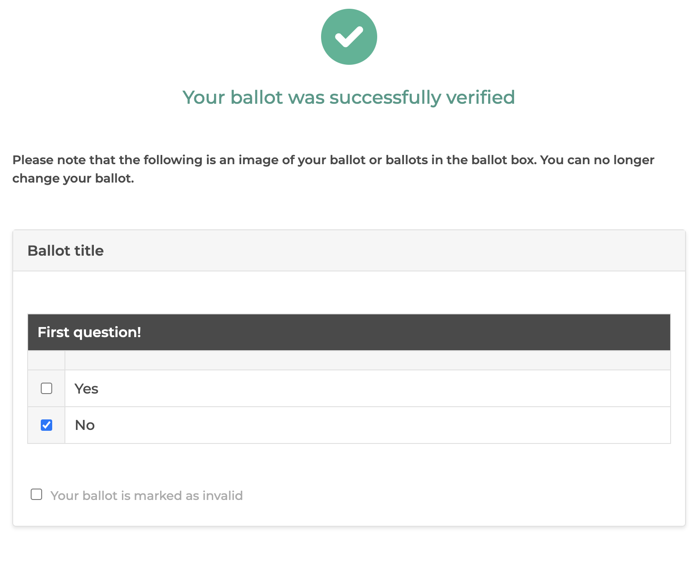

# Polyas-Core3 Second Device Protocol

**Version 1.1** 

Tomasz Truderung • POLYAS GmbH

## Introduction

The **Polyas Core 3 Verifiable** e-voting system offers an option of the
cast-as-intended verifiability, where voters can use a second-device, such as a
mobile phone, to audit their ballot.

To fully utilize the security benefits of this approach, the application used by
voters to carry out the ballot audit process should be audited by independent
parties or even, optimally, independently implemented.
_This document is intended for potential authors of such independent
implementations. It provides an overview of the ballot audit
protocol and the details necessary for the implementation._

The ballot audit process described in this document implements the method
presented in [1], [2], with an optimisation presented in the next section.

This protocol is compatible with the version of Polyas Core 3 Verifiable
e-voting system, as presented in [[3]](../pdf/polyas3.0-verifiable.pdf).
In particular, it shares the underlying
cryptographic setting ([3], Section A.2) and uses some algorithms presented
there. The reader of this document will need to consult some parts of
[[3]](../pdf/polyas3.0-verifiable.pdf).

## The Application Flow

The ballot audit application carries out the ballot audit process, displays the content of
the ballot cast on the voter's behalf, and offers a signed receipt to download.

We assume here that the application is properly set up, which is discussed 
in the section below.

The overall process of ballot audit works as follows.

1. **Initialization:** The application is started by the voter who scans the
   QR-code displayed by their main voting device. This QR-code contains the link
   to this app along with a (partially encrypted) payload.

2. **Login:** The voter is prompted to authenticate theirself by providing
   a _time-based one-time password_ (TOTP), displayed on the first device. This application
   passes this one-time password to the vote server, along with the
   voter identifier, a nonce provided inside the QR code, and a *commitment $c$ to
   the ZKP challenge* (which is a part of the interactive
   zero-knowledge proof exchanged between this application and the vote
   server).
   
   The *initial response* from the server, returned after successful
   authentication, contains:
   
   - public election parameters, such as the election public key and the
     verification key of the election system (the key used to verify signatures
     issued by the system),
   - a value $s$ generated by the server pseudo-randomly for each individual voter,
   - the encrypted ballot of the voter, as stored in the ballot box, along with
     a signed acknowledgement of the server on this ballot,
   - the *initial message* of the zero-knowledge proof.

3. **Verification:** In the verification step, the application sends to the vote server
   an opening to the commitment $c$ which reveals the committed challenge $e$. The vote
   server checks that the opening to the commitment and responds with the *final
   message* of the zero-knowledge proof.
   
   This application applies then the verification procedure which uses the
   following input:
   
   - the content of the QR-code; this content is decrypted using a symmetric
     key derived from the value $s$ returned from the server
     after successful login,
   - the *initial message* included in the login response,
   - its own challenge $e$,
   - the *final message* returned by the server in the last step.
   
4. **Confirmation and receipt:** When the interactive zero-knowledge proof is
   completed successfully, the application displays the choice
   included in the cast ballot and may offer a receipt for download (another
   option is to pass the receipt automatically to auditors without involving the
   voter in this process).

This application flow is depicted on the following diagram.



We emphasise that the election secret key is not used during this process. 
We also note that the election system, while participating in the zero-knowledge
protocol in the role of the prover, does not learn anything when doing it.
In particular, it does not learn how the voter voted. In this sense, the
election system carries out the role of an "oblivious prover" – a prover who
doesn't know what it is proving.

## The Setup

To fully utilize the security benefits of the ballot audit with the second
device, this web application should be deployed independently form the main
voter's web application. Moreover, some consistency checks should be carried out
to make sure that the parameters of this deployment are consistent with the
verification package used for the universal verifiability procedure. The
process, in more details, looks as follows.

1. When the election system is deployed and bootstrapped, it creates so called
   **second-device public parameters**, that is parameters of the voting process
   relevant for the ballot audit. These parameters include
   
   - the *public election key* (used to encrypt ballots), 
   - the *receipt verification key* (used to check signatures on the ballot
     receipts issued by the voting system to the voter),
   - the *content of the ballots* presented to the voters.
   
   The e-voting system offers the **fingerprint** of these public parameters
   (technically it is ths SHA-512 hash of the JSON representation of the
   second-device public parameters). This fingerprint can be downloaded
   via the Election Admin Panel. 

2. The second-device application should be pre-configured with this
   fingerprint. 
   
    With this configuration, the second-device application should not accept
    any data which does not match this fingerprint (by issuing the fingerprint the
    e-voting system commits to the content of the public parameters and by
    having this fingerprint preconfigured the second-device makes sure that the
    data exchanged with the e-voting system uses public parameters which are
    committed to).

3. In the audit phase — after the election has been tallied and the verification
   package produced — it should be checked that the content of the verification
   package is consistent with the fingerprint that the second device application
   was pre-configured with. This process is supported by the verification
   tool (note that the verification package contains the second-device public
   parameters).
   
   This check can be done either by the auditors (in which case the party
   hosting the second device application provides the auditors with the used
   fingerprints) or directly by the party hosting the second device.

## Protocol Details

We present here the complete process, from the setup to the ballot audit.

We illustrate this process by example data which comes from an actual protocol 
run (and can therefore be used as a basis for unit test fixtures). In this example data,
we assume that the **second-device fingerprint** used to pre-configure the 
ballot audit application is

```
b7e8e76c369d6a9ca268e40cde8347ac443040d6c4a1df3035744ace05b94e00
849abf083ae5baa8fee462a723823054858387ec35462a49f93c2ea40b2fc876
```

and the **content of the QR code** (displayed to the voter on the first device)
is of the following form (up to the URL of the second device application): 

```
URL?c=vtWXj-YxxTV2ektefJ5pk7AWc9saoPbu6wJZUZ9R1t8ekU89x7SCYLcg8ODi3fHST4BTmAK97XN3XqWc
  &vid=voter8
  &nonce=4bf8cecf3fb4c4b4372005e13a53dce705123fab5b9e9288461e6d8fbf9644ea
```

### Fetching the election data

In the initial step, the application fetches the general election data using:

**`GET rest/electionData`**

The server responds with a payload of type [ElectionData](#electiondata)
(see also [the API documentation](#get-restelectiondata)).

An example response is given below.

```
{
  "title": {
    "default": "My Election Title",
    "value": {}
  },
  "languages": ["EN", "DE"] 
}
```

This method does not require authentication and returns only basic information
about the election, such as the title and the supported languages. This 
information is intended to be displayed by the audit device in the initial 
step, where the voter is prompted to log in.

### Login request

The application should display the information obtained in the step above, along
with the voter identifier passed in the QR-code (see above), and to prompt the voter
to enter the current time-based one-time password (as displayed by the first voting
device). Once the voter provides the password and proceeds to the login, 
the application should issue the request

**`POST rest/login`**

with the body content of type [SecondDeviceLogin](#seconddevicelogin);
see the [API documentation](#post-restlogin) for details.

**Example Request**:

```
{
  "voterId": "voter8",
  "nonce": "4bf8cecf3fb4c4b4372005e13a53dce705123fab5b9e9288461e6d8fbf9644ea",
  "password": "196308",
  "challengeCommitment": "030e1a9be2459151057e9d731b524ca435f1c05bc0a95d3d82b30512d306172b17"
}
```

Fields `voterId` and `nonce` are taken from the QR-code (see above), while the `password`
is provided by the voter.
The filed `challengeCommitment` should contain value $c$, computed as 
follows (see [[3]](../pdf/polyas3.0-verifiable.pdf), 
Appendix A.2, for the used cryptographic setting and notation): 

Sample random $e,r ∈ Z_q$ and compute $c = k^r g^e$, where
$k$ is the pre-defined commitment key (an elliptic curve point given by) 
$k$ = `0373744f99d31509eb5f8caaabc0cc3fab70e571a5db4d762020723b9cd6ada260`

> The value of the commitment key $k$ is generated using the method
> described in Appendix A.6 of [3], section "Selecting independent generators", 
> where the value of parameter `seed` is set to `"pedersen-commitment-key"`. 
> This explicit generation method
> provides an assurance that this value is independent of the group generator $g$.

Note that $c$ is a Pedersen commitment to $e$ with the randomization factor $r$.
The values $e$ and $r$ will be needed in the later steps of the protocol.

### Login response

If the login data is correct, the **response** of the e-voting system is of
type [SecondDeviceLoginResponse](#seconddeviceloginresponse) (embedded in
an `ResponseBean`; see the [API documentation](#post-restlogin) for details),
such as the following **example response** (corresponding to the above example request):

```
{
  "value": {
    "token": "MDIwNWJmMmUxNDQ5NmY2OGMwZjg2ZjZiMzEzZjIxMGE5MzkzZWRiMDgzODIxZGNjNGY5OTE0Y2FiOWM1MWM5ZjJl.UjVXYXRxTlRzdk12QWRwOA==",
    "ballotVoterId": "0205bf2e14496f68c0f86f6b313f210a9393edb083821dcc4f9914cab9c51c9f2e",
    "electionId": "bfced618-34aa-4b78-ba5b-d21dc04a1a7e",
    "languages": [
      "EN",
      "DE"
    ],
    "title": {
      "default": "My Election Title",
      "value": {}
    },
    "contentAbove": {
      "value": {
        "default": "This is content above",
        "value": {}
      },
      "contentType": "TEXT"
    },
    "publicLabel": "A",
    "messages": {},
    "allowInvalid": true,
    "initialMessage": "{\"secondDeviceParametersJson\":\"{\\\"publicKey\\\":\\\"030588c6c80497da9e50bf56a4853c9fd3dd945a5e2ed741ccf783c5538611da26\\\",\\\"verificationKey\\\":\\\"30820122300d06092a864886f70d01010105000382010f003082010a0282010100a52865923e9a08c8e58c0beacd3f40391f980b7db7a87c626d68dbf2a2a28a848402e5adc7ae7d3afef34b697bcf26e5c29b3be55850f2c7a308d90573d6b3788339104fc7579b07b483ccafa11f12ad123f6eaeb3a64a5cdc3f944ed613d5ad1bb6f8cbb704682d16391f731fac0c87dfe84859c9c9fd690a57cbe7a7bdf3a69d3e8457a1afd88112bf44538b6a04809b3e61ef9608c24ef1f02d6796e73bbeff49efca7a9cf443e36791bce307323d1a05f7fd8d8697b820f632eb50b19a2b4f20c958e193ec80b269e4a1b322bbd2a9d27ba91e7e1f5440bf944cdb1658f5d6d612a0b1d838cbbe19640fd4c5d967b03b95c388910c6ce0c3ecd9340af3f90203010001\\\",\\\"ballots\\\":[{\\\"type\\\":\\\"STANDARD_BALLOT\\\",\\\"id\\\":\\\"A\\\",\\\"title\\\":{\\\"default\\\":\\\"Ballot title\\\",\\\"value\\\":{}},\\\"lists\\\":[{\\\"id\\\":\\\"A1\\\",\\\"title\\\":{\\\"default\\\":\\\"First question!\\\",\\\"value\\\":{}},\\\"columnHeaders\\\":[{\\\"default\\\":\\\"\\\",\\\"value\\\":{}}],\\\"candidates\\\":[{\\\"id\\\":\\\"A1-1\\\",\\\"columns\\\":[{\\\"value\\\":{\\\"default\\\":\\\"Yes\\\",\\\"value\\\":{}},\\\"contentType\\\":\\\"TEXT\\\"}],\\\"maxVotes\\\":1,\\\"minVotes\\\":0},{\\\"id\\\":\\\"A1-2\\\",\\\"columns\\\":[{\\\"value\\\":{\\\"default\\\":\\\"No\\\",\\\"value\\\":{}},\\\"contentType\\\":\\\"TEXT\\\"}],\\\"maxVotes\\\":1,\\\"minVotes\\\":0}],\\\"maxVotesOnList\\\":1,\\\"minVotesOnList\\\":1,\\\"maxVotesForList\\\":0,\\\"minVotesForList\\\":0,\\\"voteCandidateXorList\\\":false}],\\\"showInvalidOption\\\":true,\\\"showAbstainOption\\\":false,\\\"maxVotes\\\":1,\\\"minVotes\\\":0,\\\"prohibitMoreVotes\\\":false,\\\"prohibitLessVotes\\\":false,\\\"calculateAvailableVotes\\\":false}]}\",\"comSeed\":\"a240ec46ff7adefb01b5b8d6fade3c96cb50c40f737a3cffbd98a0e9e6415ea2\",\"publicCredential\":\"0205bf2e14496f68c0f86f6b313f210a9393edb083821dcc4f9914cab9c51c9f2e\",\"ballot\":{\"encryptedChoice\":{\"ciphertexts\":[{\"x\":\"03bf956c38e14a6f81ed3621e165fb8c6000c28738f0e279fa28d2254d6b799eb1\",\"y\":\"02e19fbd88d9e1ad760653dde8e7f00fcc0d45e2b38ccc0cb2301f2239d4fcac3f\"}]},\"proofOfKnowledgeOfEncryptionCoins\":[{\"c\":\"79966540728819921955585823592173536360716995948664894735154654897488787881072\",\"f\":\"90388416755735603296616014607154433872748203957820626540975447356971608146868\"}],\"proofOfKnowledgeOfPrivateCredential\":{\"c\":\"4219105992081372606513358125198075081967495840895255912931536426010398533192\",\"f\":\"110464010855198853861051741469261963282081696331616030540127604123885412224008\"}},\"signatureHex\":\"529f3e8c7d1f0e2c8061526d8e1d8000c24ab60b32b3bda0ce959788483f977fb12da70ccb7ac154a698ef925cf7ca52e142f8eb22d23e5ccd42b63da227230bf886b13211f5c1f618a946a64f8566fd36849b46a156d4a35288204fd7b22e15fcdce8884b5d6e5c69b07ca271332ba14eced079402c735db642b82ae7478fe2efe849d8c50ba11b7d6985486607a54ea42c6394dc2060ac58cfa9c69cc750816dad43fb74d113ab7bc014e619649688fdbf96a29c894fa2cfc5d2bac8b897d0c8dbb3b79e5c17a90913dcb4ba583ea90e706891d38278745c1b4856f88d045c38b840d4fd427291187c250b2ed7bc846fa25440e98d3e9832f2047e52bc5207\",\"factorX\":[\"03aacd547442d178a6fd95d949d84ecc17bbf16bb2428b7598f6abce29a1459a5a\"],\"factorY\":[\"0228136a113abad456a2cb690b4a38cea7ef3ba7839b74550aa5bc53a5af88a868\"],\"factorA\":[\"0340abe2067662ca5b3b2d122e4aaf7971db4209763ee8949d506e8c974e6c2ddd\"],\"factorB\":[\"026bcbe81a01c159c9e42045dbded1ca37ac0d664e3fe3e24bac342c4db28c8647\"]}"
  },
  "status": "OK"
}
```

The response contains further election metadata, the authentication token
to be used in the successive calls and the _initial message_, in 
JSON format. This initial message (after deserialization) is of type
[SecondDeviceInitialMsg](#seconddeviceinitialmsg) and looks as follows:

```
{
  "secondDeviceParametersJson": "{\"publicKey\":\"030588c6c80497da9e50bf56a4853c9fd3dd945a5e2ed741ccf783c5538611da26\",\"verificationKey\":\"30820122300d06092a864886f70d01010105000382010f003082010a0282010100a52865923e9a08c8e58c0beacd3f40391f980b7db7a87c626d68dbf2a2a28a848402e5adc7ae7d3afef34b697bcf26e5c29b3be55850f2c7a308d90573d6b3788339104fc7579b07b483ccafa11f12ad123f6eaeb3a64a5cdc3f944ed613d5ad1bb6f8cbb704682d16391f731fac0c87dfe84859c9c9fd690a57cbe7a7bdf3a69d3e8457a1afd88112bf44538b6a04809b3e61ef9608c24ef1f02d6796e73bbeff49efca7a9cf443e36791bce307323d1a05f7fd8d8697b820f632eb50b19a2b4f20c958e193ec80b269e4a1b322bbd2a9d27ba91e7e1f5440bf944cdb1658f5d6d612a0b1d838cbbe19640fd4c5d967b03b95c388910c6ce0c3ecd9340af3f90203010001\",\"ballots\":[{\"type\":\"STANDARD_BALLOT\",\"id\":\"A\",\"title\":{\"default\":\"Ballot title\",\"value\":{}},\"lists\":[{\"id\":\"A1\",\"title\":{\"default\":\"First question!\",\"value\":{}},\"columnHeaders\":[{\"default\":\"\",\"value\":{}}],\"candidates\":[{\"id\":\"A1-1\",\"columns\":[{\"value\":{\"default\":\"Yes\",\"value\":{}},\"contentType\":\"TEXT\"}],\"maxVotes\":1,\"minVotes\":0},{\"id\":\"A1-2\",\"columns\":[{\"value\":{\"default\":\"No\",\"value\":{}},\"contentType\":\"TEXT\"}],\"maxVotes\":1,\"minVotes\":0}],\"maxVotesOnList\":1,\"minVotesOnList\":1,\"maxVotesForList\":0,\"minVotesForList\":0,\"voteCandidateXorList\":false}],\"showInvalidOption\":true,\"showAbstainOption\":false,\"maxVotes\":1,\"minVotes\":0,\"prohibitMoreVotes\":false,\"prohibitLessVotes\":false,\"calculateAvailableVotes\":false}]}",
  "comSeed": "a240ec46ff7adefb01b5b8d6fade3c96cb50c40f737a3cffbd98a0e9e6415ea2",
  "publicCredential": "0205bf2e14496f68c0f86f6b313f210a9393edb083821dcc4f9914cab9c51c9f2e",
  "ballot": {
    "encryptedChoice": {
      "ciphertexts": [
        {
          "x": "03bf956c38e14a6f81ed3621e165fb8c6000c28738f0e279fa28d2254d6b799eb1",
          "y": "02e19fbd88d9e1ad760653dde8e7f00fcc0d45e2b38ccc0cb2301f2239d4fcac3f"
        }
      ]
    },
    "proofOfKnowledgeOfEncryptionCoins": [
      {
        "c": "79966540728819921955585823592173536360716995948664894735154654897488787881072",
        "f": "90388416755735603296616014607154433872748203957820626540975447356971608146868"
      }
    ],
    "proofOfKnowledgeOfPrivateCredential": {
      "c": "4219105992081372606513358125198075081967495840895255912931536426010398533192",
      "f": "110464010855198853861051741469261963282081696331616030540127604123885412224008"
    }
  },
  "signatureHex": "529f3e8c7d1f0e2c8061526d8e1d8000c24ab60b32b3bda0ce959788483f977fb12da70ccb7ac154a698ef925cf7ca52e142f8eb22d23e5ccd42b63da227230bf886b13211f5c1f618a946a64f8566fd36849b46a156d4a35288204fd7b22e15fcdce8884b5d6e5c69b07ca271332ba14eced079402c735db642b82ae7478fe2efe849d8c50ba11b7d6985486607a54ea42c6394dc2060ac58cfa9c69cc750816dad43fb74d113ab7bc014e619649688fdbf96a29c894fa2cfc5d2bac8b897d0c8dbb3b79e5c17a90913dcb4ba583ea90e706891d38278745c1b4856f88d045c38b840d4fd427291187c250b2ed7bc846fa25440e98d3e9832f2047e52bc5207",
  "factorX": [
    "03aacd547442d178a6fd95d949d84ecc17bbf16bb2428b7598f6abce29a1459a5a"
  ],
  "factorY": [
    "0228136a113abad456a2cb690b4a38cea7ef3ba7839b74550aa5bc53a5af88a868"
  ],
  "factorA": [
    "0340abe2067662ca5b3b2d122e4aaf7971db4209763ee8949d506e8c974e6c2ddd"
  ],
  "factorB": [
    "026bcbe81a01c159c9e42045dbded1ca37ac0d664e3fe3e24bac342c4db28c8647"
  ]
}
```

This object contains 

- the initial message of the ZKP protocol exchange (`factorX`, `factorY`, `factorA`, `factorB`), 
- the seed to be used for decryption of the QR-code content (`comSeed`)
- the public credential of the voter,
- the ballot of the voter, as recorder in the ballot box,
- the signature of the election system on the voter's ballot (`signatureHex`),
- the second device public parameters as JSON; this JSON string encodes a value of type
  [VerifiableSecondDeviceParameters](#verifiableseconddeviceparameters), containing
  the public election key,
  the verification key of the server (to check the acknowledgements), and
  the description of the ballot the voter is voting for

### Integrity of the second device public parameters

The JSON value provide in `secondDeviceParametersJson` should match
the pre-configured second device parameter fingerprint. 
To verify this match, the ballot audit application should hash this JSON
value (using UTF-8 encoding in order to translate it to a byte array) with 
SHA-512 and check that the result of this hashing, when represented as a
hexadecimal string, is equal to the pre-configured fingerprint. 

Only after this check has been successfully carried out, the application can trust
that the values deserialized from this JSON object (`ballots`, `publicKey`, `verificationKey`)
can be trusted. If this check fails, the application should abort the ballot audit
process with an appropriate message.

### Checking the acknowledgement

The ballot audit application should now check the acknowledgement, that is
the signature of the election system on the voter's ballot. This signature
confirms that the ballot is included in the ballot box and can be then used
to make sure that the ballot has been, as expected, included in the final tally.

The signature `signatureHex` is given as a byte array in a hexadecimal encoding.
The signature is checked using the `verificationKey` from the deserialized
`secondDeviceParametersJson`. This key is expected to be an RSA public key
in the `X509` encoding (note that a key in such encoding, when prepended 
with `-----BEGIN PUBLIC KEY-----` and followed with
`-----END PUBLIC KEY-----`, would constitute a valid PEM file).

In order to verify the signature, the application first needs to compute 
the sequence of bytes to be signed (`BTBS`). This byte sequence includes the normalized 
representation of the ballot, along with the additional 
voter's data, as specified below, where `put` denotes appending data to the
byte array and `putWithLength` denotes appending the binary representation of 
the given data, prepended with its length.

```
putWithLength(publicLabel)
putWithLength(publicCredential)
putWithLength(ballotVoterId)

ballotAsNormalizedBytestring()
```

where `ballotAsNormalizedBytestring` is defined as follows:

```
put(encryptedChoice.ciphertexts.size)

for ((x, y) in encryptedChoice.ciphertexts) {
    putWithLength(group.asBytes(x))
    putWithLength(group.asBytes(y))
}

put(proofOfKnowledgeOfEncryptionCoins.size)

for ((c, f) in proofOfKnowledgeOfEncryptionCoins) {
    putWithLength(c.toByteArray())
    putWithLength(f.toByteArray())
}

putWithLength(proofOfKnowledgeOfPrivateCredential.c.toByteArray())
putWithLength(proofOfKnowledgeOfPrivateCredential.f.toByteArray())
```

Example: for the response data from the example above, the `BTBS` is as follows.

```
 0000000141000000210205bf2e14496f68c0f86f6b313f210a9393edb083821dcc4f9914cab9c51c9f2e00000042303230356266326531343439366636386330663836663662333133663231306139333933656462303833383231646363346639393134636162396335316339663265000000010000002103bf956c38e14a6f81ed3621e165fb8c6000c28738f0e279fa28d2254d6b799eb10000002102e19fbd88d9e1ad760653dde8e7f00fcc0d45e2b38ccc0cb2301f2239d4fcac3f000000010000002100b0cb75473491d930dfffdf51f65753db9e6d1252720f50532bd6a4ddb5073c700000002100c7d607e9d00ebb3849a3632d1e64bdc726ea3ba0ce564a0de2c578f1d5db83b4000000200953edeaf6598b16e39aab05f7a751a5d68c0190ef6c10b64b602b6a97c1a6480000002100f4386a1cefe2f2ef00aef6b4cc107ec5ec13984f65e1c941fdf49882986f0c08
```

Once such a byte sequence is computed, it should be hashed
using the SHA-256 algorithm, in order to obtain the _ballot fingerprint_.

For the considered example the ballot fingerprint is

```
91dd5f592932c7c681f20310c801e7ea935f116527b65ce6524f14c6ad2f9dac
```

Finally, the application should verify that the
given signature is a valid signature on this fingerprint (the hash of the normalized
byte representation), with respect to the provided verification key.

### Decrypting the QR-code

The `c` parameter of the QR-code (see above) contains an encrypted payload.
To decrypt it, apply the following steps:

1. Let `ballotNorm` be the normalized bytes representation of the ballot, as computed
   by `ballotAsNormalizedBytestring` above.

2. Let `hashBallot` be the SHA-256 hash of `ballotNorm`.

3. Let  `key_derivation_key` be the concatenation of `comSeed` and `hashBallot`

4. Let `comKey` be `kdfCounterMode(key_derivation_key, 16, '', '')`, where
   `kdfCounterMode` is the key derivation function defined in [3], Algorithm 1.
   
   Example: For our example protocol run, the value of `comKey` is
   `dd96a88777267c645ff14648c9e03f6c9f56652a07fa3bf72e8a5f63f4288307`.

5. Compute `AESDecrypt(comKey, decodeBase64(c))`
   using AES in the GCM mode (with IV of length 12 bytes coming first, 
   followed by the TAG of length 16 bytes and, finally, the encryption itself).
   Let us call this decrypted value `randomCoinSeed`.
   
   Example: For our example protocol run, the decrypted value is
   `1e89b5f95deae82f6f823b52709117405f057783eda018d72cbd83141d394fbd`.

The decrypted value will be used in a later step.

### Challenge and the Final Message

Once all the above steps have been carried out successfully, the ballot audit
application is ready to issue the **challenge request**

**`POST rest/challenge`**

with the body content of type [ChallengeRequest](#challengerequest) and
including the authentication token from the login response in the headers.
See the [API documentation](#post-restchallenge) for details.

Example request:

```
{
  "challenge": "108039209026641834721998202775536164454916176078442584841940316235417705823230",
  "challengeRandomCoin": "44267717001895006656767798790813376597351395807170189462353830054915294464906"
}
```

Field `challenge` should contain value $e$ and field `challengeRandomCoin`
should contain value $r$
generated above (section _Login request_). It means that, in this request,
the ballot audit application opens the commitment included in the login request.

If the provided values are valid (that is if they, in fact, constitute a valid 
opening to the commitment from the login request), the server responds with
a payload of type `String` (enveloped in a `ResponseBean`). This string
contains a JSON which can be deserialized to a value of type 
[SecondDeviceFinalMsg](#seconddevicefinalmsg), as in the following 
**example response**:

```
{
  "value": "{\"z\":[\"3633826251616834446657553661530373736489206587264246793596555854504147120873052400272122845815239659486740186516083053240689380948861192914781931033170662\"]}",
  "status": "OK"
}
```

where $z$ is the final message of the ZKP protocol exchange.

### Validating the ZKP proof

The ballot audit application, after having received the final message $z$,
is expected to carry out the following checks, in order to determine, if the
zero-knowledge proof exchange should be accepted.

- Check that the length of the
  arrays `factorA`, `factorB`, `factorX`, `factorY`, and `z` is the same as the
  length $n$ of the ciphertext (`ballot.encryptedChoice.ciphertexts`).

- For all `i in [0..n)`, check equalities
   $\displaystyle A = \frac{g^z}{X^e}$
   and $\displaystyle B = \frac{h^z}{Y^e}$,
   where
  
  - $A=$ `factorA[i]`, $B=$ `factorB[i], `$X=$ `factorX[i]`, $Y=$ `factorY[i]`,
    from the login response,
  - $e=$ `challenge` from the request above,
  - $z=$ `z[i]` from the response above,
  - $h=$ is the election public key `publicKey` from the login response.

  Note the arithmetic operations are carried out in the used cyclic group (see [3]).

- Compute the sequence of random coins 
  `randomCoins = numbersFromSeed(n, groupOrder, randomCoinSeed)`, where
  `randomCoinSeed` is defined above (see section _Decrypting the QR-code_) and 
  function `numbersFromSeed` is defined in [3], Algorithm 3.
  
  For the example protocol run we consider, this sequence will contain only one
  element `115383914388283582501768653457363159558776433376562817712059811925202949510311`.

- For all `i in [0..n)`, check that $u \cdot X = g^r$, where
  
  - $u$ is the `x` component of the $i$-th ciphertext, that is `ballot.encryptedChoice.ciphertexts[i].x`,
  - $X$ is, as above, `factorX[i]`,
  - $r$ is the $i$-th random coin `randomCoins[i]`.

If any of these checks fail, abort the protocol.

### Decoding and displaying the voter's choice

When the above steps have succeeded, the ballot audit application
should display the plaintext voter's choice. 

In the first step, 
the plaint-text voter's choice needs to be extracted from the encrypted
ballot with the help of `randomCoins`, computed above. For this,
we compute the sequence of group elements
$\displaystyle c_i = \frac{w_i \cdot Y_i}{h^{r_i}}$, for $i \in [0..n)$, where

- $w_i = $ `ballot.encryptedChoice.ciphertexts[i].y`,
- $Y_i = $ `factorY[i]`,
- $r_i = $ `randomCoins[i]`, as defined above.

We then map this sequence of the group elements (elliptic curve points)
to a sequence of numbers in $Z_q$, using the decoding algorithm defined in [3], Appendix A.2.1.
This sequence of numbers is then transformed to a byte array using
the Algorithm 6 of [3]. Let us call this byte array the _encoded choice_.

For our example protocol run, this encoded choice (represtented as a hexadecimal 
string) is `00000001`.

Such an encoded choice can be now interpreted against the ballot definition,
as provided in the login response (as part of 
[VerifiableSecondDeviceParameters](#verifiableseconddeviceparameters)).
The details of this interpretation (ballot encoding and decoding) are given
in Appendix A.8 (Final Ballot Tallying) of [3].
The ballot definition contains the content of the ballots, which allows the
audit device to display the voter's choice in an explicit form close to how
it looked in the first voting device. 

For our example, this can look as follows.



Note that the ballot definition contains not only the "visible content" of the ballots,
but also additional information, including for instance ballot validation rules 
(such as the maximum number of ballots for candidates). The ballot audit application
can ignore this additional information, as it is expected to render the ballot 
as it is (as cast), without interpreting the validation and counting rules.
The important point is that the displayed representation of the cast ballot
should clearly communicate the recorder voter's choice (and nothing more).

### The Receipt

The signed acknowledgement included in the initial message (login response),
along with the computed ballot fingerprint, can be transformed to the following
format offered to the voter for download or given directly to the auditors (who
can then make sure that the voter's ballot is included in the tally).

```
Project ID: bfced618-34aa-4b78-ba5b-d21dc04a1a7e
Voter ID: 0205bf2e14496f68c0f86f6b313f210a9393edb083821dcc4f9914cab9c51c9f2e
Ballot Fingerprint: 91dd5f5929

-----BEGIN FINGERPRINT-----
91dd5f592932c7c681f20310c801e7ea935f116527b65ce6524f14c6ad2f9dac
-----END FINGERPRINT-----
-----BEGIN SIGNATURE-----
529f3e8c7d1f0e2c8061526d8e1d8000c24ab60b32b3bda0ce959788483f977f
b12da70ccb7ac154a698ef925cf7ca52e142f8eb22d23e5ccd42b63da227230b
f886b13211f5c1f618a946a64f8566fd36849b46a156d4a35288204fd7b22e15
fcdce8884b5d6e5c69b07ca271332ba14eced079402c735db642b82ae7478fe2
efe849d8c50ba11b7d6985486607a54ea42c6394dc2060ac58cfa9c69cc75081
6dad43fb74d113ab7bc014e619649688fdbf96a29c894fa2cfc5d2bac8b897d0
c8dbb3b79e5c17a90913dcb4ba583ea90e706891d38278745c1b4856f88d045c
38b840d4fd427291187c250b2ed7bc846fa25440e98d3e9832f2047e52bc5207
-----END SIGNATURE-----
```

Note that we assume here that this acknowledgement has been already checked,
as described in section _Checking the acknowledgement_.

## References

* [1] Johannes Müller, Tomasz Truderung, _CAISED: A Protocol for Cast-as-Intended
  Verifiability with a Second Device_. In: E-Vote-ID 2023. Lecture Notes in Computer Science, vol 14230. Springer,
  https://doi.org/10.1007/978-3-031-43756-4_8

* [2] Johannes Müller, Tomasz Truderung, _A Protocol for Cast-as-Intended Verifiability with a Second Device_,
  [arXiv:2304.09456](https://arxiv.org/abs/2304.09456)

* [3] [_POLYAS 3.0 Verifiable E-Voting System, Version 1.3.2_](../pdf/polyas3.0-verifiable.pdf)


## APPENDIX 1: An Optimisation 

As mentioned in the introduction, the ballot audit process described in this 
document implements the method presented in [1], [2]. We augmented, however, 
this method with the following optimisation.

In [1], [2], the voting device sends $r^\ast = x + r$ to the audit device
(via the QR-code); this value is then used to decode the voter's choice
in the last step of the protocol.  In the version of the method
presented here, the QR code contains, instead, the `randomCoinSeed`
which is used to generate a pseudo-random sequence `randomCoins` used to
decode the voters choice (see Sections _Validating the ZKP proof_ and
_Decoding and displaying the voter's choice_).

The motivation for this change is as follows. For log multi-cipher
texts (cipher texts consisting of multiple ElGamal cipher texts),
directly following the method of [1], [2] would result in QR codes
containing many big integers, quickly making the QR-code excessively big and
impossible to handle.

However, to make this optimisation work, we need to first make the following
change int the protocol:

First, instead of selecting a random encryption coin $r$ and then computing
$r^\ast = x + r$, the first device selects random $r^\ast$ and then computes
$r$ such that $r^\ast = x + r$ (and uses r as the random encryption coin).
Justification for this step is that the resulting distributions are
identical (note that the computations are done here modulo $q$). 

Second, with the above modification, we can now apply the
described above optimisation: instead of randomly choosing a sequence
$r^\ast$, we randomly choose a seed, and generate $r^\ast$ from this seed.
With this, we can include the seed (which is of constant length
independently of the size of the cipher text) in the QR code.


## APPENDIX 2: The Backend API

This documentation specifies the REST end-points offered by the
Polyas Core3 Vote backend.
(the details of the protocol are not covered here and the examles included
here contain some mock data)

#### GET `rest/electionData`

Returns basic election data (title, languages)

- **Response**: [`ElectionData`](#electiondata)

*Examples:*

> ▷︎ GET `rest/electionData`
> 
> Returns: 200 OK
> 
> ```
> {
>   "title" : {
>     "default" : "Vorstands- und Präsidiumwahlen 2019",
>     "value" : { }
>   },
>   "languages" : [ "DE" ]
> }
> ```

---

#### POST `rest/login`

Logs in the voter using ...

- **Request**: [`SecondDeviceLogin`](#seconddevicelogin)
- **Response**: [`ResponseBean`](#responsebean)<[`SecondDeviceLoginResponse`](#seconddeviceloginresponse)>

*Examples:*

> ▷︎ POST `rest/login`
> 
> with payload:
> 
> ```
> {
>   "voterId" : "voterId",
>   "password" : "invalid-password",
>   "nonce" : "nonce",
>   "challengeCommitment" : "challenge"
> }
> ```
> 
> Returns: 200 OK
> 
> ```
> {
>   "error" : "INVALID_LOGIN",
>   "status" : "ERROR"
> }
> ```

> ▷︎ POST `rest/login`
> 
> with payload:
> 
> ```
> {
>   "voterId" : "voterA",
>   "password" : "530728",
>   "nonce" : "93af68ebc62f281518067b28edcdcb59b05397d8b95be4b01327fbc41ab025a5",
>   "challengeCommitment" : "challenge-commitment"
> }
> ```
> 
> Returns: 200 OK
> 
> ```
> {
>   "value" : {
>     "token" : "dm90ZXJB.Z21jczRLSVVXQTdCblh2eg==",
>     "ballotVoterId" : "voterA",
>     "electionId" : "ELECTIONHASH",
>     "languages" : [ "DE" ],
>     "title" : {
>       "default" : "Vorstands- und Präsidiumwahlen 2019",
>       "value" : { }
>     },
>     "logo" : {
>       "default" : {
>         "hash" : "HASH",
>         "url" : "img/gi.png",
>         "alt" : "Logo"
>       },
>       "value" :  ... 
>  --- example truncated ---
> ```

---

#### POST `rest/challenge`

Challenges the ZKP prover to obtain the final ZKP response.

The string returned (inside the ResponseBean) contains a JSON representation
of type [SecondDeviceFinalMsg](#seconddevicefinalmsg).

- **Headers**: `AuthToken` A valid authentication token, as returned by login
- **Request**: [`ChallengeRequest`](#challengerequest)
- **Response**: [`ResponseBean`](#responsebean)<`String`>

*Examples:*

> ▷︎ POST `rest/challenge`
> 
> with headers:
> 
> ```
> AuthToken : dm90ZXJB.Z21jczRLSVVXQTdCblh2eg==
> ```
> 
> with payload:
> 
> ```
> {
>   "challenge" : 111222333444555666777888,
>   "challengeRandomCoin" : 999999900000008888888001
> }
> ```
> 
> Returns: 200 OK
> 
> ```
> {
>   "value" : "{...second-device-final-message...}",
>   "status" : "OK"
> }
> ```

> ▷︎ POST `rest/challenge`
> 
> with headers:
> 
> ```
> AuthToken : wrong token
> ```
> 
> with payload:
> 
> ```
> {
>   "challenge" : 111222333444555666777888,
>   "challengeRandomCoin" : 999999900000008888888001
> }
> ```
> 
> Returns: 401 Unauthorized

---

## APPENDIX 3: Used Types

- [`Ballot`](#ballot)
- [`ChallengeRequest`](#challengerequest)
- [`Ciphertext`](#ciphertext)
- [`Content`](#content)
- [`Content.RichText`](#contentrichtext)
- [`Content.Text`](#contenttext)
- [`Core3Ballot`](#core3ballot)
- [`Core3StandardBallot`](#core3standardballot)
- [`Core3StandardBallot.AutofillConfig`](#core3standardballotautofillconfig)
- [`Core3StandardBallot.AutofillSpec`](#core3standardballotautofillspec)
- [`Core3StandardBallot.CandidateList`](#core3standardballotcandidatelist)
- [`Core3StandardBallot.CandidateSpec`](#core3standardballotcandidatespec)
- [`Core3StandardBallot.ColumnProperties`](#core3standardballotcolumnproperties)
- [`Core3StandardBallot.DerivedListVotesSpec`](#core3standardballotderivedlistvotesspec)
- [`Core3StandardBallot.DerivedListVotesSpec.Variant`](#core3standardballotderivedlistvotesspecvariant)
- [`Document`](#document)
- [`ElectionData`](#electiondata)
- [`I18n`](#i18n)
- [`ImageRef`](#imageref)
- [`Language`](#language)
- [`MultiCiphertext`](#multiciphertext)
- [`Node`](#node)
- [`Node.Block`](#nodeblock)
- [`Node.Inline`](#nodeinline)
- [`Node.Mark`](#nodemark)
- [`Node.Text`](#nodetext)
- [`ObjectType`](#objecttype)
- [`Proof`](#proof)
- [`ResponseBean`](#responsebean)
- [`ResponseBean.Error`](#responsebeanerror)
- [`ResponseBean.OK`](#responsebeanok)
- [`SecondDeviceFinalMsg`](#seconddevicefinalmsg)
- [`SecondDeviceInitialMsg`](#seconddeviceinitialmsg)
- [`SecondDeviceLogin`](#seconddevicelogin)
- [`SecondDeviceLoginResponse`](#seconddeviceloginresponse)
- [`VerifiableSecondDeviceParameters`](#verifiableseconddeviceparameters)

### Ballot

Type parameters: `<GroupElem>`

Encrypted ballot containing (encrypted) voter's choice and appropriate zero-knowledge proofs

Consists of:

- `encryptedChoice` : [`MultiCiphertext`](#multiciphertext)`<GroupElem>`
  
  Encrypted voter's choice (represented as a multi-ciphertext)

- `proofOfKnowledgeOfEncryptionCoins` : `List<`[`Proof`](#proof)`>`
  
  Sequence of zero-knowledge proofs of knowledge of the random coins used to encrypt the voter's choice(one for each ciphertext in the multi-ciphertext `encryptedChoice`)

- `proofOfKnowledgeOfPrivateCredential` : [`Proof`](#proof)
  
  Zero-knowledge proof of knowledge of the private credential

### ChallengeRequest

A challenge request, issued by the second-device applcation in the second step of the zer-knowledge proof protocol.

Consists of:

- `challenge` : `BigInteger`
  
  The challenge

- `challengeRandomCoin` : `BigInteger`
  
  The random coin used in the commitment to the above challenge

### Ciphertext

Type parameters: `<GroupElement>`

ElGamal ciphertext over the given set of group elements

Consists of:

- `x` : `GroupElement`
- `y` : `GroupElement`

### Content

Content with a value of some type `T` with internationalization.

One of:

- [`Content.Text`](#contenttext)
- [`Content.RichText`](#contentrichtext)

### Content.RichText

Consists of:

- `value` : [`I18n`](#i18n)`<`[`Document`](#document)`>`
- `contentType` = `"RICH_TEXT"`

### Content.Text

Consists of:

- `value` : [`I18n`](#i18n)`<String>`
- `contentType` = `"TEXT"`

### Core3Ballot

Specification of a ballot content, validation and counting rules

One of:

- [`Core3StandardBallot`](#core3standardballot)

### Core3StandardBallot

Specification of a standard ballot content and ballot validation rules

Consists of:

- `calculateAvailableVotes` : `Boolean`
  
  If true, the voter front-end application displays the number of available votes. Does not affect validation and counting.

- `colorSchema` ?: `String`
  
  Optional color schema that the voter front-end application will use for this ballot. The color schema is the name of a CSS class that the voter front-end application knows.

- `contentAbove` ?: [`Content`](#content)
  
  Optional content to be displayed at the top of the ballot

- `contentBelow` ?: [`Content`](#content)
  
  Optional content to be displayed at the bottom of the ballot

- `externalIdentification` ?: `String`
  
  Optional external identification of the ballot supplied by third party vendors like UniWahl4.

- `id` : `String`
  
  Identifier of the ballot, unique in the scope of the electionTemplate

- `lists` : `List<`[`Core3StandardBallot.CandidateList`](#core3standardballotcandidatelist)`>`
  
  Sequence of candidate lists

- `maxListsWithChoices` ?: `Int`
  
  The maximum number of lists where the voter can place his/her choices. If `null`, there are no restrictions.

- `maxVotes` : `Int`
  
  The maximal total number of votes (crosses) of all kinds a voter can select in the whole ballot; ballots with bigger number of crosses will be rejected as invalid

- `maxVotesForCandidates` ?: `Int`
  
  The maximal allowed number of votes for candidates (as opposed to votes for lists) in the whole ballot

- `maxVotesForLists` ?: `Int`
  
  The maximal allowed number of votes for lists in the whole ballot

- `minVotes` : `Int`
  
  The lower bound on the total number of votes a voter can select in the whole ballot; ballots with smaller number of crosses will be rejected as invalid

- `minVotesForCandidates` ?: `Int`
  
  The minimal required number of votes for candidates (as opposed to votes for lists) in the whole ballot

- `minVotesForLists` ?: `Int`
  
  The minimal required number of votes for lists in the whole ballot

- `prohibitLessVotes` : `Boolean`
  
  If true, the client can't cast a vote with less crosses than required (by minVotes, minVotesForLists, minVotesForCandidates)

- `prohibitMoreVotes` : `Boolean`
  
  If true, the client can't cast a vote with more crosses than allowed (by maxVotes, maxVotesForLists, maxVotesForCandidates)

- `showAbstainOption` : `Boolean`
  
  If true, an abstention checkbox is shown

- `showInvalidOption` : `Boolean`
  
  If true, a checkbox is shown for explicitly marking the ballot as invalid

- `title` : [`I18n`](#i18n)`<String>`
  
  Title of the ballot

- `type` = `"STANDARD_BALLOT"`

### Core3StandardBallot.AutofillConfig

Consists of:

- `skipVoted` : `Boolean`
  
  If true autofill procedure will skip candidates that have already votes.

- `spec` : [`Core3StandardBallot.AutofillSpec`](#core3standardballotautofillspec)
  
  Defines the autofill behavior. BALANCED means up to down in loops, TOPDOWN means left to right.

### Core3StandardBallot.AutofillSpec

One of the following values:

- `"BALANCED"`
  
  The votes available for the list are auto-assigned to the candidates in rounds: in each round,
  the candidates, starting from the top and going down, are assigned one vote each,
  as long as there are votes left.

- `"TOPDOWN"`
  
  The first candidate on the list gets as many votes as possible, then the next one and so on,
  until the number of votes available for the list is distributed.

### Core3StandardBallot.CandidateList

Specification of a candidate list (a list of candidates/voting options)

Consists of:

- ~~autofill~~ ?: [`Core3StandardBallot.AutofillSpec`](#core3standardballotautofillspec)
  
  *Deprecated → Use autofillConfig instead*
  
  If not null, the auto-fill behavior will be activated in the voter frontend application. This flag has no consequences on validation and counting.

- `autofillConfig` ?: [`Core3StandardBallot.AutofillConfig`](#core3standardballotautofillconfig)
  
  If present autofill is activated. It contains then the configuration.

- `candidates` : `List<`[`Core3StandardBallot.CandidateSpec`](#core3standardballotcandidatespec)`>`
  
  List of candidate specifications

- `columnHeaders` : `List<`[`I18n`](#i18n)`>`
  
  List of column headers

- `columnProperties` ?: `List<`[`Core3StandardBallot.ColumnProperties`](#core3standardballotcolumnproperties)`>`
  
  Special properties for each column

- `contentAbove` ?: [`Content`](#content)
  
  Optional content to be displayed above the title

- ~~countCandidateVotesAsListVotes~~ ?: `Boolean`
  
  *Deprecated → Use derivedListVotes instead*
  
  If true, each vote for a candidate on this list is also counted as a vote for the list

- `derivedListVotes` ?: [`Core3StandardBallot.DerivedListVotesSpec`](#core3standardballotderivedlistvotesspec)
  
  Optional specification of derived list votes, where votes for candidates count as votes for the list

- `externalIdentification` ?: `String`
  
  Optional external identification of the list supplied by third party vendors like UniWahl4.

- `id` : `String`
  
  The identifier of the list, unique in the scope of the electionTemplate

- `maxVotesForList` : `Int`
  
  The maximal allowed number of votes for this list (crosses next to the list header). Non-zero value is used for elections with list voting.

- `maxVotesOnList` : `Int`
  
  The maximal allowed total number of votes (for regular candidates) on the list

- `maxVotesTotal` ?: `Int`
  
  The maximal allowed total number of votes (of both types: on and for the list)

- `minVotesForList` : `Int`
  
  The minimal required number of votes for this list (crosses next to the list header)

- `minVotesOnList` : `Int`
  
  The minimal required total number of votes (for regular candidates) on the list

- `minVotesTotal` ?: `Int`
  
  The minimal required total number of votes (of both types: on and for the list)

- `title` ?: [`I18n`](#i18n)`<String>`
  
  The title (headline) of the candidate list (optional)

- `voteCandidateXorList` : `Boolean`
  
  If true, the voter is not allowed to place votes on the list and for the list at the same time

### Core3StandardBallot.CandidateSpec

Specification of a candidate (voting option)

Consists of:

- `columns` : `List<`[`Content`](#content)`>`
  
  The content of the consecutive columns describing the candidate; the number of columns should correspond to the number of the column headers in the enclosing `CandidateList`

- `externalIdentification` ?: `String`
  
  Optional external identification of the candidate supplied by third party vendors like UniWahl4.

- `id` : `String`
  
  The identifier of the candidate, unique in the scope of electionTemplate

- `maxVotes` : `Int`
  
  The maximal number of votes that can be given to the candidate

- `minVotes` : `Int`
  
  The minimal required number of votes that must be given to the candidate

- `writeInSize` ?: `Int`
  
  If non-null and non-zero, the field represents a write-in with the given size, where the content is used as a placeholder

### Core3StandardBallot.ColumnProperties

Special properties for a column in a candidate list

Consists of:

- `hide` : `Boolean`
  
  Hide this column in the voter front-end

### Core3StandardBallot.DerivedListVotesSpec

Consists of:

- `variant` : [`Core3StandardBallot.DerivedListVotesSpec.Variant`](#core3standardballotderivedlistvotesspecvariant)

### Core3StandardBallot.DerivedListVotesSpec.Variant

One of the following values:

- `"EACH_VOTE_COUNTS"`
  
  Each vote for a candidate is counted as a vote for the list.

- `"AT_MOST_ONE"`
  
  The list gets exactly one extra vote, if at least one candidate on this list is selected.

### Document

Formatted content, following the Slate format. Field `object` is expected
to be `"document"`.

Consists of:

- `data` : `Map<String`, `String>`
- `nodes` : `List<`[`Node`](#node)`>`
- `object` : [`ObjectType`](#objecttype)

### ElectionData

Basic election data, used on the initial page of the second-device application

Consists of:

- `languages` : `List<`[`Language`](#language)`>`
  
  List of languages supported by the election

- `title` : [`I18n`](#i18n)`<String>`
  
  The title of the election

### I18n

Type parameters: `<T>`

A value of type `T` with internationalization (possibly different values for different languages)

Consists of:

- `default` : `T`
  
  The default value (used when there is no values specifed for the requested language)

- `value` : `Map<`[`Language`](#language), `T>`
  
  A mapping from languages to values of type `T`

### ImageRef

Consists of:

- `alt` : `String`
- `hash` : `String`
- `url` : `String`

### Language

Language code

One of the following values:

`DE` | `EN` | `FR` | `FI` | `IT` | `PL` | `NL` | `CZ` | `ES` | `NO` | `DK` | `ROU` | `SVK` | `SE` | `RU` | `HU` | `AR`

### MultiCiphertext

Type parameters: `<GroupElement>`

List of ElGamal ciphertexts (over the given set of group elements); used to represent an encryption of a message which does not fit into one ciphertext

Consists of:

- `auxData` ?: `Map<String`, `String>`
- `ciphertexts` : `List<`[`Ciphertext`](#ciphertext)`>`

### Node

One of:

- [`Node.Block`](#nodeblock)
- [`Node.Inline`](#nodeinline)
- [`Node.Text`](#nodetext)

### Node.Block

A node representing a block element. Chosen types are interpreted
(`paragraph`, `heading-one`, `heading-two`, `heading-three`,
`block-quote`, `code`, `ordered-list`, `unordered-list`, `list-item`)
as appropriate elements, with the `data` map interpreted as additional properties.

Consists of:

- `data` : `Map<String`, `String>`
- `nodes` : `List<`[`Node`](#node)`>`
- `type` : `String`
- `object` = `"block"`

### Node.Inline

A node representing an inline element.
Type `link` is mapped to an anchor, with the URL defined by `data`

Consists of:

- `data` : `Map<String`, `String>`
- `nodes` : `List<`[`Node`](#node)`>`
- `type` : `String`
- `object` = `"inline"`

### Node.Mark

Additional formatting information. Field `object` is expected to be `mark`.

Consists of:

- `data` : `Map<String`, `String>`
- `object` : `String`
- `type` : `String`

### Node.Text

A node representing the given text.
Chosen mark types (`bold`, `italic`, `underlined`, `strikethrough`) are mapped to
appropriate classes.

Consists of:

- `marks` : `Set<`[`Node.Mark`](#nodemark)`>`
- `text` : `String`
- `object` = `"text"`

### ObjectType

One of the following values:

`document` | `block` | `inline` | `text`

### Proof

Zero-knowledge proof of the knowledge of the descrete logarighm.

Consists of:

- `c` : `BigInteger`
- `f` : `BigInteger`

### ResponseBean

One of:

- [`ResponseBean.OK`](#responsebeanok)
- [`ResponseBean.Error`](#responsebeanerror)

### ResponseBean.Error

Consists of:

- `error` : `String`
- `status` = `"ERROR"`

### ResponseBean.OK

Type parameters: `<T>`

Consists of:

- `value` : `T`
- `status` = `"OK"`

### SecondDeviceFinalMsg

Consists of:

- `z` : `List<BigInteger>`

### SecondDeviceInitialMsg

Type parameters: `<G>`

Consists of:

- `ballot` : [`Ballot`](#ballot)`<G>`
  
  The encrypted ballot cast by the voter

- `comSeed` : `Bytes`
  
  A (pseudo-random) seed used for generating a communication key between the first and the second voter's devices.

- `factorA` : `List<G>`

- `factorB` : `List<G>`

- `factorX` : `List<G>`

- `factorY` : `List<G>`

- `publicCredential` : `G`
  
  Voter's public credential (verification key for the voter's signatures).

- `secondDeviceParametersJson` : `String(Json)`
  
  The second-device public parameter, such as the receipt verification key, as JSON representing [VerifiableSecondDeviceParameters](#verifiableseconddeviceparameters).

- `signatureHex` : `String`
  
  Server's signature on the cast ballot (the acknowledgement)

### SecondDeviceLogin

Login request of the second-device application

Consists of:

- `challengeCommitment` : `String`
  
  A commitment to the challenge, computed by the second-device application, as the initial step of the zero-knowledge protocol

- `nonce` : `String`
  
  The login nonce, as provided in the QR-code

- `password` : `String`
  
  The time-based one-time password, as displayed by the first voter's device

- `voterId` : `String`
  
  The voter login identifier

### SecondDeviceLoginResponse

A response of the election system to the login request in the the second-device (ballot audit) protocol

Consists of:

- `allowInvalid` : `Boolean`
  
  A flag determining, if a voter should be able to explicitly mark a ballot as invalid.

- `ballotVoterId` : `String`
  
  The identifier of the voter, as used by the voting system; may be different than the login identifier

- `contentAbove` ?: [`Content`](#content)
  
  The content to be displayed above the ballot content

- `electionId` : `String`
  
  The identifier of the election

- `initialMessage` : `String`
  
  The initial message of the ZKP prover, as a JSON representation of [SecondDeviceInitialMsg](#seconddeviceinitialmsg)

- `languages` : `List<`[`Language`](#language)`>`
  
  A list of languages supported by the election

- `logo` ?: [`I18n`](#i18n)`<`[`ImageRef`](#imageref)`>`
  
  The electino logo (possibly in multiple variants for different languages)

- `messages` : `Map<String`, [`I18n`](#i18n)`>`
  
  Custom messages (replacing the standard messages shown to the voters)

- `publicLabel` : `String`
  
  The so-called public label of the voter (relevant for elections with voter groups)

- `title` : [`I18n`](#i18n)`<String>`
  
  The title of the election (possibly in multiple languages)

- `token` : `String`
  
  An authentication token, to be used by the second-device application in the following requests

### VerifiableSecondDeviceParameters

Consists of:

- `ballots` : `List<`[`Core3Ballot`](#core3ballot)`>`
  
  Ballots offered to the voters

- `publicKey` : `String`
  
  The public election kay as a hex-string.

- `verificationKey` : `String`
  
  The receipt verification key as a hex-string.
