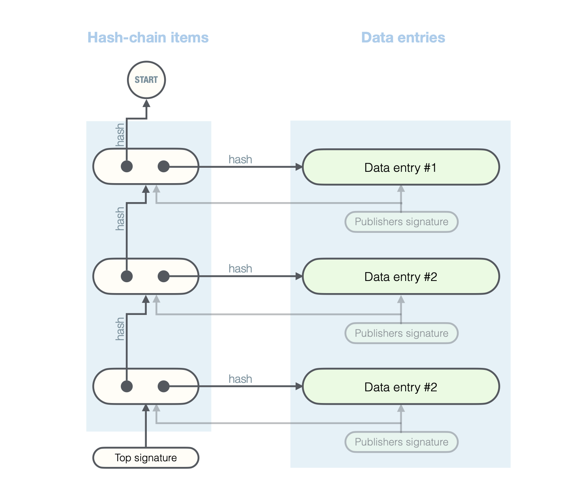

# Secure Bulletin Boards

For all version of the Core 3, all data relevant for the election process is
published on so called *secure bulletin boards*. Such boards provide a
protection mechanism against unintended modification of data. The intended
policy is that anything which is relevant for the election process is recorded
on such boards and, once recorder, it is never deleted or changed.

A special instances of a secure bulletin boards are: **the ballot box** (the
secure bulletin board where the encrypted ballots are collected) and the
registry board (where the public keys of voters are published). Also the
result of the intermediate operations (such as the shuffled ballots) and the
final (decrypted) election results are published on dedicated secure bulletin
boards. Moreover, for all the changes of the state of the election, such as
“open voting phase” and “close voting phase”, the corresponding entries are
published on designated boards and protected against changes.

## Overview of the Concept

A secure bulletin board is a data storage which enforces append-only policy:
new entries can be added to a bulletin board, but no entries are supposed to
be deleted or modified. To enforce this policy, a signed hash chains are used,
as depicted on the following picture.

When a new data entry is added to a secure bulletin board, a corresponding
**hash-chain item** (see the elements on the left-hand side of the picture) is
created, which refers to the added data entry and to the previous hash chain
item by their cryptographic hashes. Each time a client accesses a given
bulletin board (where by a *client* we mean any entity eligible to read from
the board or write to it and by *accessing* we mean, for instance, reading an
entry), it obtains not only the requested data, but also the current **top
hash-chain item** signed by the bulletin board (see the signature on the
bottom-left). A signed top hash-chain item is a light-weight commitment to the
whole content of the secure bulletin board. It means that while it itself is
pretty small (does not contain the whole content of the bulletin board), the
whole content of the board is bound by it.

The above-mentioned top signature, is created by the bulletin board and it can
be checked (and stored for potential future reference) by any client.
Additionally, the data entries are digitally signed by the corresponding
**publishers** (each secure bulletin board has only one publisher, that is only
one entity which is allowed to publish on it). This signature is made not only
on the content of the published data entry but also on the previous hash-chain
item, as depicted by the grey arrows on the picture. This means that the
publisher not only signs the content, but it also explicitly signs the
intended position (relative to the hash-chain).

With this mechanism, we achieve the following:

- Only the eligible publishers can publish new data entries, because the
  entries have to be signed.

- The entries cannot be maliciously or incidentally re-arranged, because the
  publisher explicitly specifies and signs the position of the new data entry
  (relative to the hash chain).

- The entries are protected against removal and modification in the following
  sense: Once a content of the bulletin board “is seen” (is accessed by any
  client), any illegal change (modification or removal of an entry) is
  detected when this board is accessed by this client the next time. Because
  the top hash is signed, if such a illegal change happens, the client has an
  evidence to hold the board accountable. The hash chain seen by clients can
  also be later reconciled with the content of the verification package (which
  also contains full hash chains of all the public bulletin boards).

In the standard operation of Core 3, every operation routinely checks
consistency of all the read secure bulletin boards. Additionally, if external
entities participate in the protocol, they also monitor the consistency of the
hash chains. Moreover, an election administrator (election council member), at
any time, can take a snapshot of the current state of all the boards, by
downloading the current signed top hashes via the Election Admin Panel.

